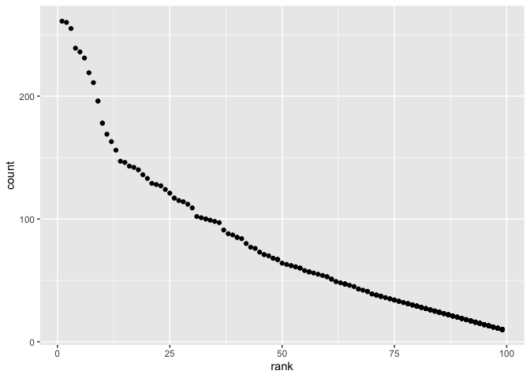

p8105\_hw2\_hf2379
================
Holly Finertie
10/4/2019

# Problem 1:

## Read and clean data sets

``` r
library(readxl)

trash_wheel = read_excel("./data/Trash-Wheel-Collection-Totals-8-6-19.xlsx", 1) %>% 
  janitor::clean_names() %>% 
  select(dumpster:homes_powered) %>% 
  drop_na(dumpster) %>% 
  mutate(sports_balls = as.integer(round(sports_balls, digits = 0)))
```

    ## New names:
    ## * `` -> ...15
    ## * `` -> ...16
    ## * `` -> ...17

``` r
precip_2017 = read_excel("./data/Trash-Wheel-Collection-Totals-8-6-19.xlsx", 6, range = "A2:B14") %>% 
  janitor::clean_names() %>% 
  drop_na(total) %>% 
  mutate(year = 2017)

precip_2018 = read_excel("./data/Trash-Wheel-Collection-Totals-8-6-19.xlsx", 5, range = "A2:B14") %>% 
  janitor::clean_names() %>% 
  drop_na(total) %>% 
  mutate(year = 2018)

precip_combined_2017_2018 = 
  bind_rows(precip_2017, precip_2018) %>% 
  mutate(month = month.name[month])
```

Two data sets have been successfully imported and cleaned: (1)
trash\_wheel and (2) precip\_both\_years.

**Trash Wheel Data Set**: This data set has 344 observations and 14
variables describing the weight and volume of trash pulled out of the
Inner Harbor in Baltimore by month from 2014 to 2019. Additional
variables describe the type of trash pulled (e.g. plastic\_bottles,
cigarette\_butts, and sports\_balls). For example, in 2014 Mr. Trash
Wheel pulled out 141.35 tons and 669 cubic yards of trash. Additionally,
in 2017 the median number of sports balls in a dumpster pulled from
Mr. Trash Wheel was 8.

**Combined Precipitation Data Set**: This data set has 24 observations
and 3 variables describing the total precipation in inches by month from
2017 to 2018. For example, from the table we know that the precipitation
in January 2018 was 0.94 inches and total precipation in 2018 was 70.33
inches.

# Problem 2:

``` r
pols_month = read_csv("./data/pols-month.csv") %>% 
  janitor::clean_names() %>% 
  separate(mon, into = c("year", "month", "day")) %>% 
  mutate(
      month = as.numeric(month),
      month = month.name[month],
      year = as.numeric(year),
      president = recode(prez_gop, `1` = "gop", `2` = "gop", `0` = "dem")) %>%
  select(-day, -prez_gop, -prez_dem)
```

    ## Parsed with column specification:
    ## cols(
    ##   mon = col_date(format = ""),
    ##   prez_gop = col_double(),
    ##   gov_gop = col_double(),
    ##   sen_gop = col_double(),
    ##   rep_gop = col_double(),
    ##   prez_dem = col_double(),
    ##   gov_dem = col_double(),
    ##   sen_dem = col_double(),
    ##   rep_dem = col_double()
    ## )

``` r
snp = read_csv("./data/snp.csv") %>% 
  janitor::clean_names() %>% 
  separate(date, into = c("month", "day", "year")) %>% 
  select("year", "month", "close") %>% 
  mutate(
      month = as.numeric(month),
      year = as.numeric(year)) %>% 
  arrange(year, month) %>% 
  mutate(month = month.name[month])
```

    ## Parsed with column specification:
    ## cols(
    ##   date = col_character(),
    ##   close = col_double()
    ## )

``` r
unemploy = read_csv("./data/unemployment.csv") %>% 
  pivot_longer(Jan:Dec, names_to = "month", values_to = "unemploy_perc") %>% 
  mutate(
    month = match(month,month.abb),
    month = month.name[month]) %>% 
 janitor::clean_names()
```

    ## Parsed with column specification:
    ## cols(
    ##   Year = col_double(),
    ##   Jan = col_double(),
    ##   Feb = col_double(),
    ##   Mar = col_double(),
    ##   Apr = col_double(),
    ##   May = col_double(),
    ##   Jun = col_double(),
    ##   Jul = col_double(),
    ##   Aug = col_double(),
    ##   Sep = col_double(),
    ##   Oct = col_double(),
    ##   Nov = col_double(),
    ##   Dec = col_double()
    ## )

``` r
snp_pols = 
  left_join(pols_month, snp, by = c("month" = "month", "year" = "year"))

final_table_538 = 
    left_join(snp_pols, unemploy, by = c("month" = "month", "year" = "year"))
```

From Five ThirtyEight, we imported 3 data sets. The first,
‘pols\_month’, included information on the number of politicans per
party affiliation by month and year from 1947 to 2015. From this
information, we created a new variable named president describing the
party affiliation of the president at that date in time. Additionally,
we imported a data set call ‘snp’ containg the Standard & Poor’s stock
market index (S\&P) closing value at each date in time from 1950 to 2015
by month. Last, we imported and tidied a data set called ‘unemploy’ with
unemployment percentages by month and year from 1948 to 2015. We used
these three data sets to create a final table with 822 observations and
11 variables with the key variables being ‘year’ and ‘month’.

# Problem 3:

``` r
baby_names = read.csv("./data/Popular_Baby_Names.csv") %>% 
  janitor::clean_names() %>% 
  mutate(
    child_s_first_name = str_to_title(child_s_first_name),
    ethnicity = 
        recode(
          ethnicity, "ASIAN AND PACI" = "ASIAN AND PACIFIC ISLANDER", 
              "BLACK NON HISP" = "BLACK NON HISPANIC", "WHITE NON HISP" = 
              "WHITE NON HISPANIC"),
    ethnicity = str_to_lower(ethnicity),
    gender = str_to_lower(gender)) %>% 
    distinct()

olivia_ranking = 
  baby_names %>%
  filter(child_s_first_name == "Olivia") %>% 
  group_by(year_of_birth, ethnicity) %>% 
  summarize(rank) %>% 
  pivot_wider(
      names_from = year_of_birth,
        values_from = rank) %>% 
  knitr::kable()

olivia_ranking
```

| ethnicity                  | 2011 | 2012 | 2013 | 2014 | 2015 | 2016 |
| :------------------------- | ---: | ---: | ---: | ---: | ---: | ---: |
| asian and pacific islander |    4 |    3 |    3 |    1 |    1 |    1 |
| black non hispanic         |   10 |    8 |    6 |    8 |    4 |    8 |
| hispanic                   |   18 |   22 |   22 |   16 |   16 |   13 |
| white non hispanic         |    2 |    4 |    1 |    1 |    1 |    1 |

``` r
first_ranked_males = 
  baby_names %>% 
  filter(rank == 1, gender == "male") %>% 
  group_by(year_of_birth, ethnicity) %>% 
  summarize(child_s_first_name) %>% 
  pivot_wider(
        names_from = year_of_birth,
        values_from = child_s_first_name) %>% 
  knitr::kable()

first_ranked_males
```

| ethnicity                  | 2011    | 2012   | 2013   | 2014   | 2015   | 2016   |
| :------------------------- | :------ | :----- | :----- | :----- | :----- | :----- |
| asian and pacific islander | Ethan   | Ryan   | Jayden | Jayden | Jayden | Ethan  |
| black non hispanic         | Jayden  | Jayden | Ethan  | Ethan  | Noah   | Noah   |
| hispanic                   | Jayden  | Jayden | Jayden | Liam   | Liam   | Liam   |
| white non hispanic         | Michael | Joseph | David  | Joseph | David  | Joseph |

``` r
plot_2016_white_males = 
  baby_names %>% 
  filter(
    gender == "male", 
    ethnicity == "white non hispanic", 
    year_of_birth == 2016) %>% 
  ggplot(aes(x = rank, y = count, )) +
    geom_point()

plot_2016_white_males
```

<!-- -->
